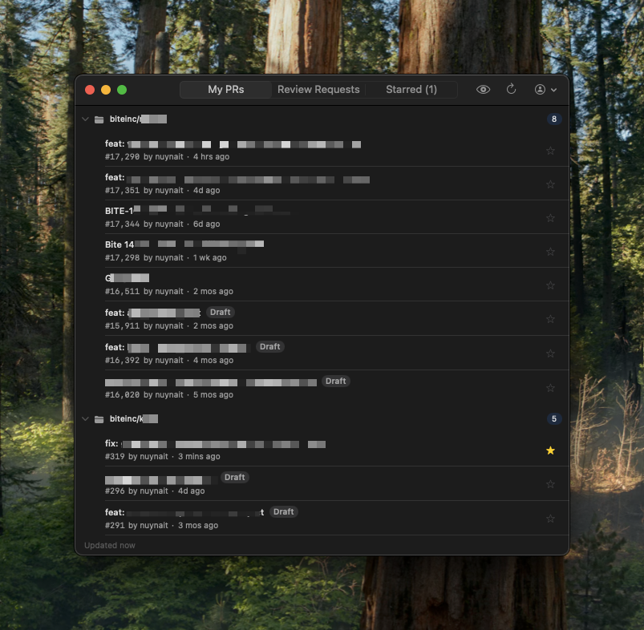
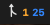
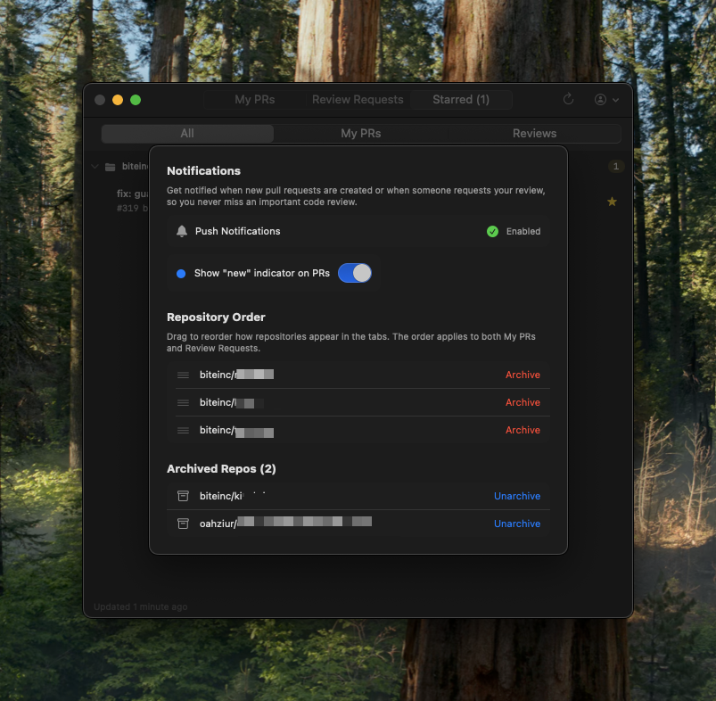

# GitHub Review

A native macOS menu bar app for monitoring your GitHub pull requests. Stay on top of your PRs and review requests without keeping GitHub open in your browser.



## Features

### Menu Bar Integration

Lives in your menu bar with at-a-glance badge counts — orange for review requests, blue for your PRs.



### PR Dashboard

- **My PRs** — All your open pull requests across every repo
- **Review Requests** — PRs where your review has been requested
- **Starred** — Pin important PRs to a dedicated tab; starred PRs persist even after being merged or closed
- PRs are grouped by repository with collapsible sections
- Click any PR to open it directly in your browser

### Unread Tracking

- Blue dot indicator on PRs that are new since your last visit
- Unread counts shown on tab labels
- Mark individual PRs as read, or mark all as read with one click
- Persists across app restarts

### Notifications

Get native macOS push notifications when:
- You open a new PR
- Your PR is merged or closed
- Someone requests your review
- You're removed from a review
- A PR you're reviewing is merged or closed

### Settings

Configure repository ordering, archive repos you don't need, and manage notification preferences.



### Additional Features

- **Star/Pin PRs** — Star important PRs to pin them to the top of their repo group
- **Merged/Closed badges** — Purple "Merged" and red "Closed" indicators on resolved PRs
- **Draft badge** — Visual indicator for draft PRs
- **Drag-and-drop repo ordering** — Customize the display order of repositories
- **Archive repos** — Hide repositories you don't want to track
- **Persistent state** — Expand/collapse state, starred PRs, read status, and repo order all persist across sessions
- **Background polling** — Auto-refreshes every 2 minutes
- **Menu bar only** — Closing the window keeps the app running in the menu bar

## Installation

1. Go to the [Releases](https://github.com/nuynait/Github-PR-Helper/releases) page
2. Download the latest `GitHubReview-vX.X.X.dmg`
3. Open the DMG and drag **GitHubReview** to **Applications**
4. On first launch, right-click the app > **Open** (required for unsigned apps)

## Authentication

Two options to sign in:

### Personal Access Token (Recommended)

1. Go to [GitHub Token Settings](https://github.com/settings/tokens)
2. Generate a new token with the following scopes:
   - `repo` — Access to private repositories
   - `read:org` — Read org membership for org-owned repos
3. Paste the token into the app

### GitHub OAuth Device Flow

1. Click "Sign in with GitHub"
2. Copy the code shown in the app
3. Open the GitHub device activation page and enter the code
4. Authorize the app

> **Note:** OAuth device flow may require organization admin approval for accessing org-owned private repos. Use a Personal Access Token to avoid this.

## Requirements

- macOS 14.0 (Sonoma) or later
- A GitHub account

## Tech Stack

- **SwiftUI** + **AppKit** — Native macOS UI with NSStatusItem for the menu bar
- **GitHub REST API** — Search API for efficient cross-repo PR fetching
- **Security framework** — Keychain for secure token storage
- **UserNotifications** — Native macOS push notifications
- **Zero dependencies** — Built entirely with Apple frameworks

## Building from Source

1. Clone the repository
2. Create a `Secrets.xcconfig` file in the `GitHubReview/` directory with your GitHub OAuth Client ID (optional, only needed for OAuth flow):
   ```
   GITHUB_CLIENT_ID = your_client_id_here
   ```
3. Open `GitHubReview/GitHubReview.xcodeproj` in Xcode
4. Build and run (Cmd+R)

## License

MIT
